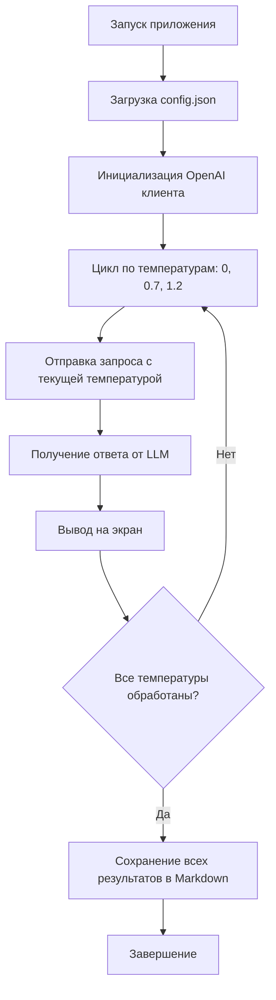

# План архитектуры приложения LLM Temperature Comparison

## Обзор

Приложение на Node.js + TypeScript, которое отправляет один и тот же запрос в LLM через OpenAI API три раза с разной температурой (0, 0.7, 1.2), отображает результаты на экране и сохраняет их в Markdown файл.

## Структура проекта

```
day-04-glm5/
├── src/
│   └── index.ts          # Основной файл приложения
├── output/               # Директория для результатов
│   └── results.md        # Файл с результатами (создается при запуске)
├── config.json           # Конфигурационный файл
├── package.json          # Зависимости проекта
├── tsconfig.json         # Конфигурация TypeScript
└── plans/                # Документация
    └── architecture-plan.md
```

## Архитектура



## Компоненты

### 1. config.json - Конфигурационный файл

```json
{
  "openai": {
    "apiKey": "YOUR_API_KEY_HERE",
    "model": "gpt-3.5-turbo",
    "baseUrl": "https://api.openai.com/v1"
  },
  "request": {
    "prompt": "Объясни квантовую физику простыми словами",
    "temperatures": [0, 0.7, 1.2],
    "maxTokens": 1000
  },
  "output": {
    "directory": "./output",
    "filename": "results.md"
  }
}
```

### 2. src/index.ts - Основная логика

**Функции:**
- `loadConfig()` - загрузка конфигурации из JSON файла
- `createOpenAIClient()` - создание экземпляра OpenAI клиента
- `sendRequest()` - отправка запроса к API с указанной температурой
- `displayResult()` - вывод результата на экран
- `saveResults()` - сохранение результатов в Markdown файл
- `main()` - основная функция, координирующая весь процесс

### 3. Зависимости (package.json)

**Основные:**
- `openai` - официальный SDK для работы с OpenAI API
- `typescript` - компилятор TypeScript

**Dev-зависимости:**
- `@types/node` - типы для Node.js
- `ts-node` - запуск TypeScript напрямую

## Формат выходного файла (Markdown)

```markdown
# Результаты запросов к LLM с разной температурой

**Запрос:** Объясни квантовую физику простыми словами

**Модель:** gpt-3.5-turbo

---

## Температура: 0

**Ответ:**
[Текст ответа]

---

## Температура: 0.7

**Ответ:**
[Текст ответа]

---

## Температура: 1.2

**Ответ:**
[Текст ответа]

---

*Дата генерации: [timestamp]*
```

## Обработка ошибок

1. **Отсутствует config.json** - вывод сообщения об ошибке с инструкцией
2. **Неверный API ключ** - понятное сообщение об ошибке авторизации
3. **Ошибка сети** - повторная попытка с экспоненциальной задержкой
4. **Ошибка сохранения файла** - вывод в консоль как fallback

## Порядок реализации

1. Инициализация проекта (`npm init`)
2. Установка зависимостей (`npm install openai`, `npm install -D typescript @types/node ts-node`)
3. Создание `tsconfig.json`
4. Создание `config.json`
5. Создание `src/index.ts` с полной логикой
6. Создание директории `output/`
7. Тестирование

## Запуск приложения

```bash
# Разработка
npx ts-node src/index.ts

# Или после компиляции
npm run build
npm start
```
