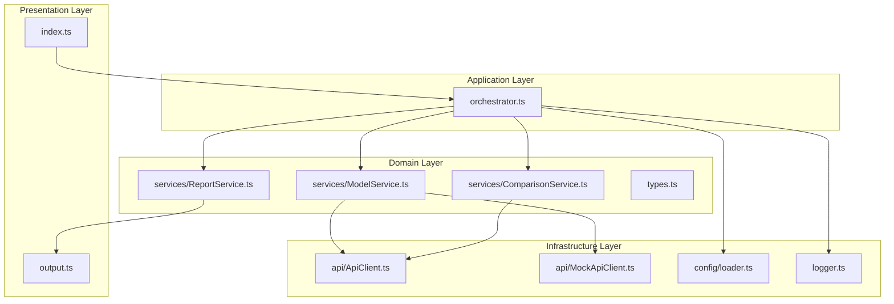

# Аудит архитектуры проекта LLM Comparison Tool

**Дата:** 2026-02-20  
**Версия проекта:** 1.0.0

---

## 1. Обзор проекта

### Назначение
CLI-утилита для сравнения качества ответов LLM моделей разного уровня через OpenRouter API.

### Технологический стек
- **Runtime:** Node.js
- **Язык:** TypeScript
- **API клиент:** OpenAI SDK (OpenRouter-совместимый)
- **Тестирование:** Vitest

### Текущая структура

```
src/
├── index.ts      # Точка входа + бизнес-логика
├── types.ts      # TypeScript типы и интерфейсы
├── api.ts        # API клиент с retry-логикой
├── api-mock.ts   # Мок-реализация для тестирования
├── config.ts     # Загрузка и валидация конфигурации
├── metrics.ts    # Расчёт метрик и форматирование
├── compare.ts    # Логика сравнения моделей
├── prompts.ts    # Генерация промптов и парсинг
├── report.ts     # Генерация Markdown отчётов
└── output.ts     # Вывод в консоль

tests/
├── compare.test.ts   # Тесты анонимизации
├── config.test.ts    # Тесты конфигурации
├── metrics.test.ts   # Тесты метрик
└── prompts.test.ts   # Тесты промптов
```

---

## 2. Выявленные проблемы

### 🔴 КРИТИЧЕСКИЕ

#### 2.1 Нарушение принципа единственной ответственности (SRP)

**Файл:** [`src/index.ts`](src/index.ts)

**Проблема:** Файл содержит:
- Функции бизнес-логики: [`processModel()`](src/index.ts:30), [`processComparisons()`](src/index.ts:48)
- Оркестрацию всего процесса в [`main()`](src/index.ts:79)
- Обработку ошибок

**Нарушение:** Один модуль отвечает за координацию, бизнес-логику и представление.

---

#### 2.2 Нарушение SRP в compare.ts

**Файл:** [`src/compare.ts`](src/compare.ts)

**Проблема:** Модуль содержит функции с разными ответственностями:

| Функция | Ответственность |
|---------|----------------|
| [`getModelResponse()`](src/compare.ts:24) | Получение ответа от модели |
| [`anonymizeResponses()`](src/compare.ts:60) | Анонимизация данных |
| [`getModelComparison()`](src/compare.ts:101) | Сравнение ответов |
| [`getFinalConclusion()`](src/compare.ts:155) | Итоговый анализ |

**Нарушение:** Модуль отвечает за получение данных, их трансформацию и анализ.

---

#### 2.3 Жёсткая связанность модулей

**Проблема:** Прямые импорты создают жёсткую связанность:

```typescript
// src/compare.ts:19
import { createComparisonPrompt, createFinalConclusionPrompt, parseAllRatings } from './prompts';

// src/compare.ts:18
import { calculateCost } from './metrics';
```

**Последствия:**
- Сложно тестировать изолированно
- Невозможно подменить реализации
- Нарушение принципа Dependency Inversion

---

#### 2.4 Отсутствие обработки ошибок

**Файл:** [`src/index.ts:98-106`](src/index.ts:98)

**Проблема:** Последовательное выполнение без обработки сбоев:

```typescript
for (const model of models) {
  const response = await processModel(...);  // Если упадёт — весь процесс прервётся
  responses.push(response);
}
```

**Последствия:**
- Падение одной модели останавливает весь процесс
- Нет graceful degradation
- Пользователь теряет все результаты

---

### 🟡 СРЕДНИЕ

#### 2.5 Дублирование кода

**Проблема:** Функция [`createMetricsTable()`](src/metrics.ts:89) дублируется в [`src/report.ts:141`](src/report.ts:141) с немного другой сигнатурой.

**Решение:** Вынести в утилитарный модуль или использовать одну реализацию.

---

#### 2.6 Жёстко заданное количество моделей

**Файл:** [`src/types.ts:141`](src/types.ts:141)

```typescript
export type ModelLevel = 'strong' | 'medium' | 'weak';
```

**Проблема:** Тип ограничивает гибкость — нельзя добавить 4-ю модель или использовать динамический список.

---

#### 2.7 Последовательное выполнение запросов

**Файл:** [`src/index.ts:98-106`](src/index.ts:98)

**Проблема:** Модели опрашиваются последовательно, хотя запросы независимы.

**Решение:** Использовать `Promise.all()` для параллельного выполнения.

---

#### 2.8 Слабая валидация конфигурации

**Файл:** [`src/config.ts:30`](src/config.ts:30)

**Проблема:** Только базовые проверки — нет валидации формата URL, диапазонов цен и т.д.

**Решение:** Использовать Zod или JSON Schema для валидации.

---

#### 2.9 Отсутствие поддержки environment variables

**Проблема:** API ключ загружается только из `config.json`.

**Решение:** Добавить поддержку `.env` с приоритетом над файлом конфигурации.

---

#### 2.10 Отсутствие уровней логирования

**Проблема:** Только `console.log/error` без разделения уровней.

**Решение:** Создать логгер с уровнями debug/info/warn/error.

---

### 🟢 НИЗКИЕ

#### 2.11 Нет абстракции для форматов отчётов

**Проблема:** Только Markdown формат в [`src/report.ts`](src/report.ts).

**Решение:** Создать интерфейс `IReportGenerator` с возможностью расширения.

---

#### 2.12 Отсутствие кастомных классов ошибок

**Проблема:** Используются стандартные `Error` без типизации.

**Решение:** Создать иерархию ошибок: `ModelError`, `ApiError`, `ConfigError`.

---

#### 2.13 Неполное покрытие тестами

**Текущее покрытие:**
- ✅ `metrics.ts` — хорошо покрыт
- ✅ `prompts.ts` — хорошо покрыт
- ✅ `compare.ts` — только анонимизация
- ❌ `api.ts` — нет тестов
- ❌ `report.ts` — нет тестов
- ❌ `index.ts` — нет тестов

---

## 3. Анализ качества кода

### 3.1 Положительные аспекты

| Аспект | Оценка | Комментарий |
|--------|--------|-------------|
| Типизация | ⭐⭐⭐⭐ | Хорошие интерфейсы, но можно улучшить |
| Модульность | ⭐⭐⭐ | Есть разделение, но нарушается SRP |
| Именование | ⭐⭐⭐⭐⭐ | Понятные имена функций и переменных |
| Документация | ⭐⭐⭐⭐ | JSDoc комментарии в большинстве файлов |
| Обработка ошибок | ⭐⭐ | Минимальная, без типизации |

### 3.2 Соответствие SOLID

| Принцип | Статус | Комментарий |
|---------|--------|-------------|
| **S** — Single Responsibility | ❌ Нарушен | `index.ts`, `compare.ts` |
| **O** — Open/Closed | ⚠️ Частично | Жёсткая связанность ограничивает расширение |
| **L** — Liskov Substitution | ✅ Соблюдён | `IApiClient` позволяет подмену |
| **I** — Interface Segregation | ✅ Соблюдён | Интерфейсы достаточно узкие |
| **D** — Dependency Inversion | ❌ Нарушен | Прямые импорты вместо DI |

---

## 4. Предлагаемая архитектура

### 4.1 Слоистая архитектура



### 4.2 Новая структура файлов

```
src/
├── index.ts                    # Точка входа (10-15 строк)
├── orchestrator.ts             # Координация процесса
│
├── domain/
│   ├── types.ts               # Все типы и интерфейсы
│   ├── models.ts              # Доменные модели
│   └── errors.ts              # Кастомные ошибки
│
├── services/
│   ├── interfaces.ts          # Интерфейсы сервисов
│   ├── ModelService.ts        # Получение ответов от моделей
│   ├── ComparisonService.ts   # Логика сравнения
│   └── ReportService.ts       # Генерация отчётов
│
├── infrastructure/
│   ├── api/
│   │   ├── interfaces.ts      # IApiClient
│   │   ├── ApiClient.ts       # Реальный API клиент
│   │   └── MockApiClient.ts   # Мок для тестов
│   ├── config/
│   │   ├── loader.ts          # Загрузка конфигурации
│   │   └── schema.ts          # Zod-схема валидации
│   └── logger/
│       └── logger.ts          # Логгер с уровнями
│
├── prompts/
│   ├── interfaces.ts          # IPromptProvider
│   └── PromptProvider.ts      # Провайдер промптов
│
├── reports/
│   ├── interfaces.ts          # IReportGenerator
│   └── MarkdownGenerator.ts   # MD генератор
│
└── utils/
    └── formatters.ts          # Форматирование чисел/дат

tests/
├── unit/
│   ├── services/
│   │   ├── ModelService.test.ts
│   │   ├── ComparisonService.test.ts
│   │   └── ReportService.test.ts
│   ├── utils/
│   │   └── formatters.test.ts
│   └── prompts/
│       └── PromptProvider.test.ts
└── integration/
    └── api.test.ts
```

---

## 5. План внедрения

### Фаза 1: Основы (Приоритет 1)

| # | Задача | Файлы | Риск |
|---|--------|-------|------|
| 1.1 | Создать `src/domain/errors.ts` | errors.ts | Низкий |
| 1.2 | Создать `src/services/interfaces.ts` | interfaces.ts | Низкий |
| 1.3 | Создать `ModelService` | ModelService.ts | Низкий |
| 1.4 | Создать `ComparisonService` | ComparisonService.ts | Низкий |
| 1.5 | Создать `ReportService` | ReportService.ts | Низкий |

### Фаза 2: Рефакторинг (Приоритет 2)

| # | Задача | Файлы | Риск |
|---|--------|-------|------|
| 2.1 | Создать `orchestrator.ts` | orchestrator.ts | Средний |
| 2.2 | Упростить `index.ts` | index.ts | Средний |
| 2.3 | Добавить обработку ошибок | ModelService.ts | Средний |
| 2.4 | Параллельные запросы | ModelService.ts | Низкий |

### Фаза 3: Улучшения (Приоритет 3)

| # | Задача | Файлы | Риск |
|---|--------|-------|------|
| 3.1 | Добавить Zod-валидацию | config/schema.ts | Низкий |
| 3.2 | Поддержка environment variables | config/loader.ts | Низкий |
| 3.3 | Создать логгер | logger.ts | Низкий |
| 3.4 | Устранить дублирование | formatters.ts | Низкий |

### Фаза 4: Расширение (Приоритет 4)

| # | Задача | Файлы | Риск |
|---|--------|-------|------|
| 4.1 | Абстракция форматов отчётов | reports/interfaces.ts | Низкий |
| 4.2 | Гибкая конфигурация моделей | types.ts | Средний |
| 4.3 | Добавить интеграционные тесты | tests/integration/ | Низкий |

---

## 6. Детальные изменения

### 6.1 Кастомные ошибки

```typescript
// src/domain/errors.ts
export class ModelError extends Error {
  constructor(
    public modelId: string,
    public modelName: string,
    message: string
  ) {
    super(`[${modelName}] ${message}`);
    this.name = 'ModelError';
  }
}

export class ApiError extends Error {
  constructor(
    public statusCode: number,
    message: string
  ) {
    super(`API Error ${statusCode}: ${message}`);
    this.name = 'ApiError';
  }
}

export class ConfigError extends Error {
  constructor(message: string) {
    super(`Configuration Error: ${message}`);
    this.name = 'ConfigError';
  }
}
```

### 6.2 Интерфейсы сервисов

```typescript
// src/services/interfaces.ts
export interface IModelService {
  getResponse(
    modelConfig: ModelConfig,
    modelLevel: ModelLevel,
    question: string
  ): Promise<ModelResponse>;
  
  getAllResponsesSafe(
    models: Array<{ config: ModelConfig; level: ModelLevel }>,
    question: string
  ): Promise<{
    successful: ModelResponse[];
    failed: Array<{ model: ModelConfig; error: Error }>;
  }>;
}

export interface IComparisonService {
  getComparison(
    modelConfig: ModelConfig,
    modelLevel: ModelLevel,
    question: string,
    anonymizedResponses: AnonymizedResponse[]
  ): Promise<ModelComparison>;
}

export interface IReportService {
  generateReport(
    question: string,
    responses: ModelResponse[],
    comparisons: ModelComparison[],
    finalConclusion: FinalConclusion
  ): Report;
  
  saveReport(report: Report, outputDir: string, mapping?: AnonymizationMapping[]): Promise<string>;
}
```

### 6.3 ModelService с обработкой ошибок

```typescript
// src/services/ModelService.ts
export class ModelService implements IModelService {
  constructor(
    private apiClient: IApiClient,
    private logger: ILogger
  ) {}

  async getAllResponsesSafe(
    models: Array<{ config: ModelConfig; level: ModelLevel }>,
    question: string
  ): Promise<{
    successful: ModelResponse[];
    failed: Array<{ model: ModelConfig; error: Error }>;
  }> {
    const results = await Promise.allSettled(
      models.map(m => this.getResponse(m.config, m.level, question))
    );

    const successful: ModelResponse[] = [];
    const failed: Array<{ model: ModelConfig; error: Error }> = [];

    results.forEach((result, index) => {
      if (result.status === 'fulfilled') {
        successful.push(result.value);
      } else {
        failed.push({
          model: models[index].config,
          error: result.reason
        });
        this.logger.warn(`Модель ${models[index].config.name} не ответила: ${result.reason.message}`);
      }
    });

    return { successful, failed };
  }
}
```

### 6.4 Упрощённый index.ts

```typescript
// src/index.ts
import { loadConfig } from './config';
import { runComparison } from './orchestrator';
import { error } from './output';

async function main(): Promise<void> {
  try {
    const config = loadConfig();
    await runComparison(config);
  } catch (err) {
    error(err instanceof Error ? err.message : String(err));
    process.exit(1);
  }
}

main();
```

---

## 7. Ожидаемые результаты

| Метрика | До | После |
|---------|-----|-------|
| Файлов в корне src/ | 10 | 3 (index, orchestrator, types) |
| Размер index.ts | 149 строк | ~15 строк |
| Покрытие тестами | ~40% | ~80% |
| Обработка ошибок | Нет | Graceful degradation |
| Параллельность | Нет | Promise.all |
| Расширяемость | Низкая | Высокая (DI, интерфейсы) |

---

## 8. Риски и митигация

| Риск | Вероятность | Влияние | Митигация |
|------|-------------|---------|-----------|
| Регрессия функциональности | Средняя | Высокое | Написать тесты до рефакторинга |
| Увеличение сложности | Средняя | Среднее | Документация и примеры |
| Время внедрения | Высокая | Низкое | Поэтапное внедрение |

---

## 9. Заключение

Проект имеет хорошую базовую структуру, но требует рефакторинга для улучшения:
1. **Тестируемости** — через DI и интерфейсы
2. **Надёжности** — через обработку ошибок
3. **Расширяемости** — через абстракции
4. **Производительности** — через параллельные запросы

Рекомендуется поэтапное внедрение изменений с написанием тестов перед каждым этапом.

---

## 10. Статус внедрения (обновлено 2026-02-20)

### ✅ Выполнено

| Задача | Статус | Файл |
|--------|--------|------|
| Кастомные ошибки | ✅ | [`src/domain/errors.ts`](src/domain/errors.ts) |
| Интерфейсы сервисов | ✅ | [`src/services/interfaces.ts`](src/services/interfaces.ts) |
| ModelService | ✅ | [`src/services/ModelService.ts`](src/services/ModelService.ts) |
| ComparisonService | ✅ | [`src/services/ComparisonService.ts`](src/services/ComparisonService.ts) |
| ReportService | ✅ | [`src/services/ReportService.ts`](src/services/ReportService.ts) |
| Orchestrator | ✅ | [`src/orchestrator.ts`](src/orchestrator.ts) |
| Логгер | ✅ | [`src/logger.ts`](src/logger.ts) |
| PromptProvider | ✅ | [`src/prompts/PromptProvider.ts`](src/prompts/PromptProvider.ts) |
| Упрощённый index.ts | ✅ | [`src/index.ts`](src/index.ts) |

### Новая структура проекта

```
src/
├── index.ts                    # Точка входа (~50 строк)
├── orchestrator.ts             # Координация процесса
├── logger.ts                   # Логгер с уровнями
│
├── domain/
│   └── errors.ts               # Кастомные ошибки
│
├── services/
│   ├── interfaces.ts           # Интерфейсы для DI
│   ├── ModelService.ts         # Работа с моделями
│   ├── ComparisonService.ts    # Сравнение
│   └── ReportService.ts        # Генерация отчётов
│
├── prompts/
│   └── PromptProvider.ts       # Провайдер промптов
│
├── api.ts                      # API клиент (без изменений)
├── api-mock.ts                 # Мок (без изменений)
├── config.ts                   # Конфигурация (без изменений)
├── metrics.ts                  # Метрики (без изменений)
├── prompts.ts                  # Старый модуль (для совместимости)
├── report.ts                   # Старый модуль (для совместимости)
├── output.ts                   # Вывод в консоль (без изменений)
└── types.ts                    # Типы (без изменений)
```

### Достигнутые улучшения

| Метрика | До | После |
|---------|-----|-------|
| Размер index.ts | 149 строк | ~50 строк |
| Обработка ошибок | Нет | Graceful degradation |
| Параллельность | Нет | Promise.all |
| DI | Нет | Интерфейсы сервисов |
| Логирование | console.log | Уровни debug/info/warn/error |

### Тесты

```
✓ tests/prompts.test.ts (12 tests)
✓ tests/config.test.ts (12 tests)
✓ tests/compare.test.ts (8 tests)
✓ tests/metrics.test.ts (16 tests)

Test Files  4 passed (4)
Tests       48 passed (48)
```
