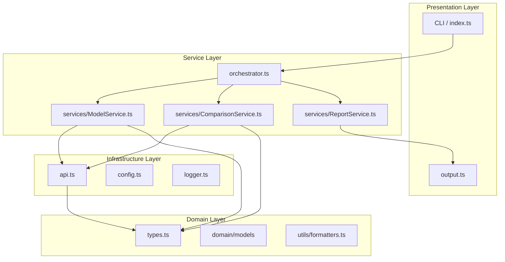

# План улучшений архитектуры

## Обзор текущего состояния

Проект представляет собой CLI-утилиту для сравнения качества ответов LLM моделей через OpenRouter API. Текущая структура:

```
src/
├── index.ts      # Точка входа + бизнес-логика
├── types.ts      # TypeScript типы
├── api.ts        # API клиент
├── api-mock.ts   # Мок для тестирования
├── config.ts     # Конфигурация
├── metrics.ts    # Расчёт метрик
├── compare.ts    # Логика сравнения
├── prompts.ts    # Промпты
├── report.ts     # Генерация отчётов
└── output.ts     # Вывод в консоль
```

---

## Выявленные проблемы

### 🔴 Критические

#### 1. Нарушение принципа единственной ответственности в index.ts

**Проблема:** Файл [`index.ts`](src/index.ts) содержит как функции бизнес-логики ([`processModel`](src/index.ts:30), [`processComparisons`](src/index.ts:48)), так и оркестрацию всего процесса.

**Решение:** Вынести бизнес-логику в отдельный сервисный слой.

```
src/
├── services/
│   ├── ModelService.ts      # Получение ответов от моделей
│   ├── ComparisonService.ts # Логика сравнения
│   └── ReportService.ts     # Генерация отчётов
├── orchestrator.ts          # Координация процесса
└── index.ts                 # Только точка входа
```

#### 2. Жёсткая связанность модулей

**Проблема:** [`compare.ts`](src/compare.ts) напрямую импортирует функции из [`prompts.ts`](src/prompts.ts), что затрудняет тестирование и замену компонентов.

**Решение:** Внедрить dependency injection через интерфейсы.

```typescript
// Пример: IPromptProvider
interface IPromptProvider {
  createComparisonPrompt(question: string, responses: AnonymizedResponse[]): string;
  createFinalConclusionPrompt(...): string;
}

// Внедрение через конструктор
class ComparisonService {
  constructor(private promptProvider: IPromptProvider) {}
}
```

#### 3. Отсутствие обработки ошибок

**Проблема:** При падении одной модели весь процесс останавливается. Нет graceful degradation.

**Решение:** Реализовать паттерн Result/Either для обработки ошибок.

```typescript
// types.ts
type Result<T, E = Error> = Success<T> | Failure<E>;

// Использование
const responses = await Promise.allSettled(
  models.map(m => processModel(apiClient, m))
);
// Продолжить с успешными результатами
```

---

### 🟡 Средние

#### 4. Дублирование кода

**Проблемы:**
- Функция [`createMetricsTable`](src/metrics.ts:89) дублируется в [`report.ts`](src/report.ts:141)
- Похожая логика форматирования в [`output.ts`](src/output.ts) и [`metrics.ts`](src/metrics.ts)

**Решение:** Создать утилитарный модуль `formatters.ts` и использовать его везде.

```
src/
└── utils/
    └── formatters.ts  # formatCost, formatTime, formatTokens, createMetricsTable
```

#### 5. Жёстко заданное количество моделей

**Проблема:** Тип [`ModelLevel`](src/types.ts:141) = 'strong' | 'medium' | 'weak' ограничивает гибкость.

**Решение:** Сделать конфигурацию моделей массивом с рангами.

```typescript
interface ModelConfig {
  id: string;
  name: string;
  rank: number;  // 1 = сильнейшая, 2 = средняя, и т.д.
  pricing: Pricing;
}

interface Config {
  models: ModelConfig[];  // Массив вместо объекта
}
```

#### 6. Последовательное выполнение запросов

**Проблема:** В [`index.ts:98-106`](src/index.ts:98) модели опрашиваются последовательно.

**Решение:** Использовать `Promise.all` для параллельных запросов.

```typescript
// Было
for (const model of models) {
  const response = await processModel(...);
  responses.push(response);
}

// Станет
const responses = await Promise.all(
  models.map(m => processModel(apiClient, m.config, m.level, question))
);
```

#### 7. Отсутствие валидации конфигурации

**Проблема:** Только базовые проверки в [`validateConfig`](src/config.ts:30).

**Решение:** Использовать JSON Schema или библиотеку zod.

```typescript
import { z } from 'zod';

const ConfigSchema = z.object({
  openRouter: z.object({
    baseUrl: z.url(),
    apiKey: z.string().min(1)
  }),
  models: z.object({...}),
  question: z.string().min(1)
});

const config = ConfigSchema.parse(rawConfig);
```

---

### 🟢 Низкие

#### 8. Отсутствие тестов

**Проблема:** В проекте нет unit-тестов.

**Решение:** Добавить Jest/Vitest с тестами для критических функций.

```
tests/
├── unit/
│   ├── metrics.test.ts
│   ├── compare.test.ts
│   └── prompts.test.ts
└── integration/
    └── api.test.ts
```

#### 9. Нет поддержки environment variables

**Проблема:** API ключ только из config.json.

**Решение:** Добавить поддержку .env с приоритетом над файлом конфигурации.

```typescript
// config.ts
const apiKey = process.env.OPENROUTER_API_KEY ?? config.openRouter.apiKey;
```

#### 10. Отсутствие уровней логирования

**Проблема:** Только `console.log` без разделения уровней.

**Решение:** Создать простой логгер с уровнями.

```typescript
// logger.ts
type LogLevel = 'debug' | 'info' | 'warn' | 'error';

const logger = {
  debug: (msg: string) => logLevel <= 'debug' && console.log(`[DEBUG] ${msg}`),
  info: (msg: string) => logLevel <= 'info' && console.log(`ℹ️ ${msg}`),
  // ...
};
```

#### 11. Нет абстракции для форматов отчётов

**Проблема:** Только Markdown формат.

**Решение:** Создать интерфейс генератора отчётов.

```typescript
interface IReportGenerator {
  generate(report: Report, mapping?: AnonymizationMapping[]): string;
  getFileExtension(): string;
}

class MarkdownReportGenerator implements IReportGenerator { ... }
class JsonReportGenerator implements IReportGenerator { ... }
```

---

## Предлагаемая новая архитектура



---

## Новая структура файлов

```
src/
├── index.ts                    # Точка входа (минимальный код)
├── orchestrator.ts             # Координация процесса
│
├── domain/
│   ├── types.ts               # Все типы и интерфейсы
│   ├── models.ts              # Доменные модели
│   └── errors.ts              # Кастомные ошибки
│
├── services/
│   ├── ModelService.ts        # Получение ответов от моделей
│   ├── ComparisonService.ts   # Логика сравнения
│   ├── ReportService.ts       # Генерация отчётов
│   └── interfaces.ts          # Интерфейсы сервисов
│
├── infrastructure/
│   ├── api/
│   │   ├── ApiClient.ts       # Реальный API клиент
│   │   ├── MockApiClient.ts   # Мок для тестов
│   │   └── interfaces.ts      # IApiClient
│   ├── config/
│   │   ├── loader.ts          # Загрузка конфигурации
│   │   └── schema.ts          # JSON Schema / Zod схема
│   └── logger/
│       └── logger.ts          # Логгер с уровнями
│
├── prompts/
│   ├── PromptProvider.ts      # Провайдер промптов
│   └── templates/
│       ├── comparison.ts      # Шаблон сравнения
│       └── conclusion.ts      # Шаблон итогового вывода
│
├── reports/
│   ├── interfaces.ts          # IReportGenerator
│   ├── MarkdownGenerator.ts   # MD генератор
│   └── JsonGenerator.ts       # JSON генератор (опционально)
│
└── utils/
    ├── formatters.ts          # Форматирование чисел/дат
    └── validators.ts          # Валидация данных

tests/
├── unit/
│   ├── services/
│   ├── utils/
│   └── prompts/
└── integration/
    └── api.test.ts
```

---

## Приоритет внедрения

| Приоритет | Задача | Сложность | Влияние |
|-----------|--------|-----------|---------|
| 1 | Вынести бизнес-логику из index.ts | Средняя | Высокое |
| 2 | Добавить обработку ошибок (Result pattern) | Средняя | Высокое |
| 3 | Параллельные запросы к моделям | Низкая | Среднее |
| 4 | Устранить дублирование кода | Низкая | Среднее |
| 5 | Добавить unit-тесты | Средняя | Высокое |
| 6 | Поддержка environment variables | Низкая | Низкое |
| 7 | Валидация через Zod/JSON Schema | Низкая | Среднее |
| 8 | Абстракция форматов отчётов | Средняя | Низкое |
| 9 | Гибкая конфигурация моделей | Средняя | Среднее |
| 10 | Логгер с уровнями | Низкая | Низкое |

---

## Следующие шаги

1. **Согласовать приоритеты** с заказчиком
2. **Создать ветку** для рефакторинга
3. **Внедрять изменения постепенно** с сохранением обратной совместимости
4. **Добавить тесты** перед каждым изменением
