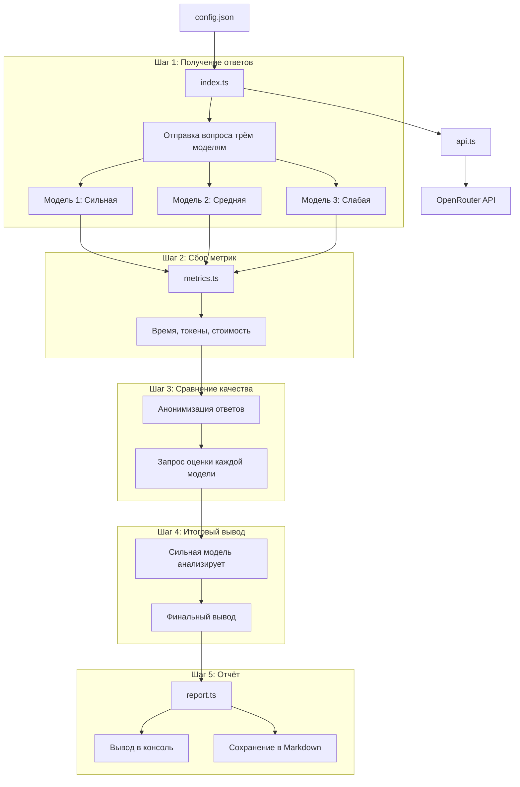

# План: Программа сравнения LLM моделей

## Обзор проекта

Программа на Node.js + TypeScript для сравнения качества ответов трёх LLM моделей разного уровня через OpenRouter API.

## Архитектура



## Структура файлов

```
day-05-multiple-models/
├── config.json           # Конфигурация API и моделей
├── package.json          # Зависимости проекта
├── tsconfig.json         # Настройки TypeScript
├── src/
│   ├── index.ts          # Точка входа
│   ├── types.ts          # Типы и интерфейсы
│   ├── api.ts            # Работа с OpenRouter API
│   ├── metrics.ts        # Расчёт метрик и стоимости
│   ├── compare.ts        # Логика сравнения моделей
│   └── report.ts         # Генерация Markdown отчёта
├── results/              # Папка для сохранения результатов
│   └── .gitkeep
└── plans/
    └── architecture.md   # Этот файл
```

## Конфигурационный файл (config.json)

```json
{
  "openRouter": {
    "baseUrl": "https://openrouter.ai/api/v1",
    "apiKey": "YOUR_API_KEY_HERE"
  },
  "models": {
    "strong": {
      "id": "anthropic/claude-3.5-sonnet",
      "name": "Claude 3.5 Sonnet",
      "pricing": {
        "input": 3.00,
        "output": 15.00
      }
    },
    "medium": {
      "id": "anthropic/claude-3-haiku",
      "name": "Claude 3 Haiku", 
      "pricing": {
        "input": 0.25,
        "output": 1.25
      }
    },
    "weak": {
      "id": "meta-llama/llama-3-8b-instruct",
      "name": "Llama 3 8B",
      "pricing": {
        "input": 0.05,
        "output": 0.10
      }
    }
  },
  "question": "Объясните, почему некоторые философы считают, что истинная свобода возможна только при наличии ограничений. Приведите примеры из разных областей человеческой деятельности.",
  "outputDir": "./results"
}
```

> **Примечание:** Цены указаны за 1M токенов в долларах США. Актуальные цены следует проверить на OpenRouter.

## Типы данных (types.ts)

```typescript
interface ModelConfig {
  id: string;           // ID модели в OpenRouter
  name: string;         // Человекочитаемое название
  pricing: {
    input: number;      // Цена за 1M input токенов
    output: number;     // Цена за 1M output токенов
  };
}

interface ModelResponse {
  modelId: string;
  modelName: string;
  content: string;
  usage: {
    inputTokens: number;
    outputTokens: number;
  };
  responseTimeMs: number;
  cost: number;
}

interface ComparisonResult {
  modelId: string;
  rating: number;       // Оценка от 1 до 10
  analysis: string;     // Текстовый анализ
}

interface FinalReport {
  timestamp: string;
  question: string;
  responses: ModelResponse[];
  comparisons: ComparisonResult[];
  finalConclusion: string;
}
```

## Поток выполнения

### Шаг 1: Получение ответов от моделей

1. Загрузить конфигурацию из `config.json`
2. Отправить одинаковый вопрос трём моделям параллельно
3. Замерить время ответа для каждой модели
4. Собрать данные о токенах из ответа API

### Шаг 2: Сбор метрик

1. Рассчитать стоимость для каждого ответа:
   - `cost = (inputTokens / 1M * inputPrice) + (outputTokens / 1M * outputPrice)`
2. Сохранить все метрики в структуру `ModelResponse`

### Шаг 3: Сравнение качества (анонимное)

1. Подготовить промпт для сравнения:
   ```
   Вам даны три ответа (Ответ 1, Ответ 2, Ответ 3) на вопрос: "{question}"
   
   Оцените каждый ответ по шкале от 1 до 10 и объясните свою оценку.
   Критерии: полнота, логичность, глубина анализа, ясность изложения.
   ```
2. Отправить этот промпт каждой модели с анонимизированными ответами
3. Собрать оценки и анализ

### Шаг 4: Итоговый вывод сильной модели

1. Подготовить промпт с результатами сравнения:
   ```
   Три модели ответили на вопрос. Вот их ответы и оценки:
   
   [Анонимизированные данные с метриками и оценками]
   
   Сделайте итоговый вывод: какая модель показала лучший результат и почему.
   Учитывайте как качество ответа, так и эффективность (стоимость/время).
   ```
2. Отправить сильной модели для финального анализа

### Шаг 5: Генерация отчёта

1. Вывести результаты в консоль с форматированием
2. Сохранить полный отчёт в Markdown файл:
   - `results/comparison-YYYY-MM-DD-HH-mm-ss.md`

## Зависимости (package.json)

```json
{
  "dependencies": {
    "axios": "^1.6.0"
  },
  "devDependencies": {
    "@types/node": "^20.0.0",
    "typescript": "^5.0.0",
    "ts-node": "^10.9.0"
  }
}
```

## Рекомендуемые модели с OpenRouter

| Уровень | Модель | ID в OpenRouter | Особенности |
|---------|--------|-----------------|-------------|
| Сильная | Claude 3.5 Sonnet | `anthropic/claude-3.5-sonnet` | Отличный анализ, рассуждения |
| Средняя | Claude 3 Haiku | `anthropic/claude-3-haiku` | Быстрая, хорошее качество |
| Слабая | Llama 3 8B | `meta-llama/llama-3-8b-instruct` | Открытая модель, базовый уровень |

Альтернативы:
- **Сильная:** `openai/gpt-4o`, `anthropic/claude-3-opus`
- **Средняя:** `openai/gpt-4o-mini`, `google/gemini-1.5-flash`
- **Слабая:** `google/gemma-2-9b-it`, `mistralai/mistral-7b-instruct`

## Вопрос для сравнения

Предлагается использовать философский вопрос, который требует:
- Глубокого анализа
- Приведения примеров
- Логических рассуждений
- Баланса между абстракцией и конкретикой

Пример: *"Объясните, почему некоторые философы считают, что истинная свобода возможна только при наличии ограничений. Приведите примеры из разных областей человеческой деятельности."*

Этот вопрос позволяет увидеть различия в:
- Глубине философского анализа
- Качестве и разнообразии примеров
- Структуре и логике изложения
- Способности синтезировать идеи

## Следующие шаги

После утверждения плана переключиться в режим Code для реализации:
1. Создать структуру файлов
2. Реализовать модули
3. Протестировать программу
