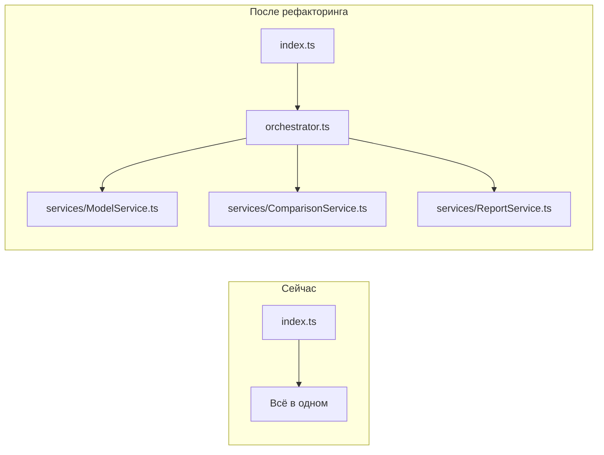

# Критические улучшения архитектуры

## Обзор

Этот документ фокусируется только на **критических проблемах** архитектуры, которые требуют первоочередного решения.

---

## 🔴 Проблема 1: Нарушение принципа единственной ответственности (SRP)

### Текущее состояние

Файл [`src/index.ts`](src/index.ts) содержит:
- Функции бизнес-логики: [`processModel`](src/index.ts:30), [`processComparisons`](src/index.ts:48)
- Оркестрацию всего процесса в [`main()`](src/index.ts:79)
- Логику обработки ошибок

Это нарушает принцип SRP — один файл отвечает за слишком много вещей.

### Предлагаемое решение

Вынести бизнес-логику в отдельные сервисы:



### Новая структура файлов

```
src/
├── index.ts              # Только точка входа (5-10 строк)
├── orchestrator.ts       # Координация процесса
├── services/
│   ├── ModelService.ts   # Получение ответов от моделей
│   ├── ComparisonService.ts # Логика сравнения
│   └── ReportService.ts  # Генерация отчётов
└── ... (остальные файлы без изменений)
```

### Пример кода

**src/services/ModelService.ts:**
```typescript
import { IApiClient, ModelConfig, ModelLevel, ModelResponse } from '../types';
import { calculateCost } from '../metrics';

export class ModelService {
  constructor(private apiClient: IApiClient) {}

  async getResponse(
    modelConfig: ModelConfig,
    modelLevel: ModelLevel,
    question: string
  ): Promise<ModelResponse> {
    const { response, responseTimeMs } = await this.apiClient.sendRequestWithTiming(
      modelConfig.id,
      [{ role: 'user', content: question }]
    );

    const usage = this.apiClient.extractUsage(response);
    const content = this.apiClient.extractContent(response);
    const cost = calculateCost(usage, modelConfig.pricing);

    return {
      modelId: modelConfig.id,
      modelName: modelConfig.name,
      modelLevel,
      content,
      usage,
      responseTimeMs,
      cost
    };
  }

  async getAllResponses(
    models: Array<{ config: ModelConfig; level: ModelLevel }>,
    question: string
  ): Promise<ModelResponse[]> {
    return Promise.all(
      models.map(m => this.getResponse(m.config, m.level, question))
    );
  }
}
```

**src/services/ComparisonService.ts:**
```typescript
import { IApiClient, ModelConfig, ModelLevel, ModelComparison, AnonymizedResponse } from '../types';
import { createComparisonPrompt, parseAllRatings } from '../prompts';

export class ComparisonService {
  constructor(private apiClient: IApiClient) {}

  async getComparison(
    modelConfig: ModelConfig,
    modelLevel: ModelLevel,
    question: string,
    anonymizedResponses: AnonymizedResponse[]
  ): Promise<ModelComparison> {
    // ... существующая логика из compare.ts
  }
}
```

**src/orchestrator.ts:**
```typescript
import { Config, IApiClient } from './types';
import { createApiClient } from './api';
import { ModelService } from './services/ModelService';
import { ComparisonService } from './services/ComparisonService';
import { ReportService } from './services/ReportService';

export async function runComparison(config: Config): Promise<void> {
  const apiClient = createApiClient(config);
  
  const modelService = new ModelService(apiClient);
  const comparisonService = new ComparisonService(apiClient);
  const reportService = new ReportService();

  // Шаги процесса...
}
```

**src/index.ts (после рефакторинга):**
```typescript
import { loadConfig } from './config';
import { runComparison } from './orchestrator';

async function main(): Promise<void> {
  try {
    const config = loadConfig();
    await runComparison(config);
  } catch (err) {
    console.error('❌', err instanceof Error ? err.message : String(err));
    process.exit(1);
  }
}

main();
```

---

## 🔴 Проблема 2: Жёсткая связанность модулей

### Текущее состояние

- [`compare.ts`](src/compare.ts) напрямую импортирует [`createComparisonPrompt`](src/prompts.ts:10) из [`prompts.ts`](src/prompts.ts)
- [`report.ts`](src/report.ts) жёстко связан с форматом Markdown
- Сложно тестировать и заменять компоненты

### Предлагаемое решение

Внедрить dependency injection через интерфейсы:

```typescript
// src/services/interfaces.ts

export interface IPromptProvider {
  createComparisonPrompt(question: string, responses: AnonymizedResponse[]): string;
  createFinalConclusionPrompt(
    question: string,
    responses: ModelResponse[],
    comparisons: ModelComparison[],
    mapping: AnonymizationMapping[]
  ): string;
  parseAllRatings(content: string): Map<number, { score: number; analysis: string }>;
}

export interface IReportGenerator {
  generate(report: Report, mapping?: AnonymizationMapping[]): string;
  getFileExtension(): string;
}
```

### Пример внедрения

```typescript
// src/services/ComparisonService.ts

export class ComparisonService {
  constructor(
    private apiClient: IApiClient,
    private promptProvider: IPromptProvider  // Внедрение зависимости
  ) {}

  async getComparison(
    modelConfig: ModelConfig,
    modelLevel: ModelLevel,
    question: string,
    anonymizedResponses: AnonymizedResponse[]
  ): Promise<ModelComparison> {
    // Используем promptProvider вместо прямого импорта
    const prompt = this.promptProvider.createComparisonPrompt(question, anonymizedResponses);
    // ...
  }
}
```

### Выгода

- Можно легко подменить промпты для разных языков
- Упрощается unit-тестирование (можно внедрить мок-провайдер)
- Соблюдается принцип Dependency Inversion из SOLID

---

## 🔴 Проблема 3: Отсутствие обработки ошибок

### Текущее состояние

При падении одной модели весь процесс останавливается:

```typescript
// src/index.ts:98-106
for (const model of models) {
  const response = await processModel(...);  // Если упадёт — весь процесс прервётся
  responses.push(response);
}
```

### Предлагаемое решение

Реализовать graceful degradation с использованием `Promise.allSettled`:

```typescript
// src/services/ModelService.ts

export class ModelService {
  // ...

  async getAllResponsesSafe(
    models: Array<{ config: ModelConfig; level: ModelLevel }>,
    question: string
  ): Promise<{
    successful: ModelResponse[];
    failed: Array<{ model: ModelConfig; error: Error }>;
  }> {
    const results = await Promise.allSettled(
      models.map(m => this.getResponse(m.config, m.level, question))
    );

    const successful: ModelResponse[] = [];
    const failed: Array<{ model: ModelConfig; error: Error }> = [];

    results.forEach((result, index) => {
      if (result.status === 'fulfilled') {
        successful.push(result.value);
      } else {
        failed.push({
          model: models[index].config,
          error: result.reason
        });
      }
    });

    return { successful, failed };
  }
}
```

### Обновлённый orchestrator

```typescript
// src/orchestrator.ts

export async function runComparison(config: Config): Promise<void> {
  const apiClient = createApiClient(config);
  const modelService = new ModelService(apiClient);

  // Получаем ответы с обработкой ошибок
  const { successful: responses, failed } = await modelService.getAllResponsesSafe(
    getModelsList(config),
    config.question
  );

  // Логируем неудачные запросы
  if (failed.length > 0) {
    console.warn(`⚠️  ${failed.length} модель(и) не ответили:`);
    failed.forEach(f => console.warn(`   - ${f.model.name}: ${f.error.message}`));
  }

  // Продолжаем с успешными ответами
  if (responses.length === 0) {
    throw new Error('Ни одна модель не ответила на запрос');
  }

  // ... продолжаем процесс
}
```

### Кастомные классы ошибок

```typescript
// src/errors.ts

export class ModelError extends Error {
  constructor(
    public modelId: string,
    public modelName: string,
    message: string
  ) {
    super(`[${modelName}] ${message}`);
    this.name = 'ModelError';
  }
}

export class ApiError extends Error {
  constructor(
    public statusCode: number,
    message: string
  ) {
    super(`API Error ${statusCode}: ${message}`);
    this.name = 'ApiError';
  }
}

export class ConfigError extends Error {
  constructor(message: string) {
    super(`Configuration Error: ${message}`);
    this.name = 'ConfigError';
  }
}
```

---

## План внедрения


### Детальные шаги

| Шаг | Действие | Файлы | Риск |
|-----|----------|-------|------|
| 1 | Создать директорию `src/services/` | - | Низкий |
| 2 | Создать `ModelService.ts` | `src/services/ModelService.ts` | Низкий |
| 3 | Создать `ComparisonService.ts` | `src/services/ComparisonService.ts` | Низкий |
| 4 | Создать `ReportService.ts` | `src/services/ReportService.ts` | Низкий |
| 5 | Создать `orchestrator.ts` | `src/orchestrator.ts` | Средний |
| 6 | Упростить `index.ts` | `src/index.ts` | Средний |
| 7 | Добавить `getAllResponsesSafe` | `src/services/ModelService.ts` | Низкий |
| 8 | Создать интерфейсы DI | `src/services/interfaces.ts` | Низкий |

---

## Итоговая структура после рефакторинга

```
src/
├── index.ts              # Точка входа (~15 строк)
├── orchestrator.ts       # Координация процесса
├── services/
│   ├── interfaces.ts     # Интерфейсы для DI
│   ├── ModelService.ts   # Работа с моделями
│   ├── ComparisonService.ts # Сравнение
│   └── ReportService.ts  # Генерация отчётов
├── errors.ts             # Кастомные ошибки (новый)
├── api.ts                # Без изменений
├── api-mock.ts           # Без изменений
├── config.ts             # Без изменений
├── metrics.ts            # Без изменений
├── prompts.ts            # Без изменений
├── report.ts             # Используется ReportService
├── output.ts             # Без изменений
└── types.ts              # Без изменений
```

---

## Ожидаемые результаты

1. **Чистое разделение ответственности** — каждый файл отвечает за одну задачу
2. **Тестируемость** — сервисы можно тестировать изолированно
3. **Надёжность** — процесс продолжается даже при падении части моделей
4. **Расширяемость** — легко добавлять новые провайдеры промптов и генераторы отчётов
