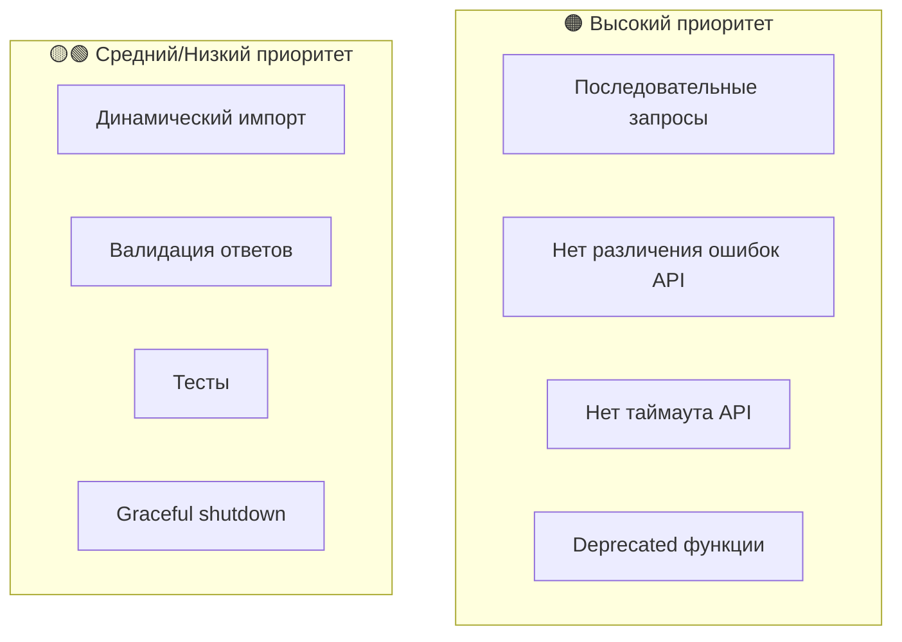

# Финальный анализ проблем проекта

## Обзор

Проект представляет собой инструмент для сравнения качества ответов LLM моделей разного уровня через OpenRouter API. После тщательного анализа кода выявлены следующие проблемы.

---

## 🟠 ВЫСОКИЙ ПРИОРИТЕТ

### #1. Последовательное выполнение запросов

**Файл:** [`src/index.ts:98-106`](src/index.ts:98)

**Проблема:** Запросы к моделям выполняются последовательно:

```typescript
for (const model of models) {
  const response = await processModel(...);  // Последовательно!
  responses.push(response);
}
```

**Последствия:**
- Общее время = сумма времён всех моделей
- При параллельном выполнении время = max(время одной модели)
- Потеря производительности до 3x

**Решение:**

```typescript
const responses = await Promise.all(
  models.map(model => processModel(apiClient, model.config, model.level, config.question))
);
```

---

### #2. Отсутствие различения типов ошибок API

**Файл:** [`src/api.ts:54-64`](src/api.ts:54)

**Проблема:** Retry выполняется для любых ошибок:

```typescript
} catch (err) {
  lastError = err instanceof Error ? err : new Error(String(err));
  // Нет проверки типа ошибки!
  if (attempt === this.maxRetries) break;
  await this.delay(this.retryDelayMs * attempt);
}
```

**Последствия:**
- Retry для ошибок аутентификации (401) - бессмысленно
- Retry для ошибок валидации (400) - бессмысленно
- Лишние задержки при фатальных ошибках

**Решение:** Добавить проверку кодов ошибок:

```typescript
} catch (err) {
  if (err.status === 401 || err.status === 400 || err.status === 403) {
    throw err; // Не повторять клиентские ошибки
  }
  // Retry только для 5xx и сетевых ошибок
}
```

---

### #3. Нет таймаута для API запросов

**Файл:** [`src/api.ts:16-27`](src/api.ts:16)

**Проблема:** Запросы к API не имеют таймаута:

```typescript
this.client = new OpenAI({
  apiKey: config.openRouter.apiKey,
  baseURL: config.openRouter.baseUrl,
  // timeout: ??? - отсутствует!
});
```

**Последствия:**
- При зависании API программа ждёт бесконечно
- Нет контроля над максимальным временем выполнения

**Решение:**

```typescript
this.client = new OpenAI({
  apiKey: config.openRouter.apiKey,
  baseURL: config.openRouter.baseUrl,
  timeout: 60000, // 60 секунд
});
```

---

### #4. Deprecated функции загромождают API

**Файл:** [`src/api.ts:118-179`](src/api.ts:118)

**Проблема:** Функции помечены `@deprecated`, но экспортируются и не используются:

```typescript
/**
 * @deprecated Используйте ApiClient.fromConfig()
 */
export function initApiClient(config: Config): void { ... }
```

**Решение:** Удалить deprecated функции.

---

## 🟡 СРЕДНИЙ ПРИОРИТЕТ

### ~~#5. Динамический импорт типов~~ ✅ ИСПРАВЛЕНО

**Файл:** [`src/report.ts:216`](src/report.ts:216)

**Было:**
```typescript
finalConclusion: import('./types').FinalConclusion
```

**Стало:**
```typescript
import { ..., FinalConclusion } from './types';
// ...
finalConclusion: FinalConclusion
```

---

### ~~#6. Отсутствие валидации ответа API~~ ✅ ИСПРАВЛЕНО

**Файл:** [`src/api.ts:93-98`](src/api.ts:93)

**Было:**
```typescript
return response.choices[0].message.content ?? '';
```

**Стало:**
```typescript
const content = response.choices[0].message.content;
if (!content || content.trim().length === 0) {
  throw new Error('Модель вернула пустой ответ');
}
return content;
```

---

### ~~#7. Дублирование кода вывода~~ ✅ ИСПРАВЛЕНО

**Файлы:** [`src/output.ts`](src/output.ts) и [`src/report.ts`](src/report.ts)

**Решение:** Добавлена общая функция [`formatModelMetrics`](src/output.ts:12) и [`printModelMetrics`](src/output.ts:22), используемая в обоих местах.

---

## 🟢 НИЗКИЙ ПРИОРИТЕТ

### #8. Отсутствие тестов

**Проблема:** Проект не содержит модульных тестов.

**Решение:** Добавить Jest или Vitest с тестами для критических функций.

---

### #9. Нет graceful shutdown

**Проблема:** При прерывании процесса (Ctrl+C) нет корректного завершения.

**Решение:** Добавить обработку SIGINT/SIGTERM.

---

### #10. Нет логирования в файл

**Проблема:** Весь вывод идёт только в консоль.

**Решение:** Добавить опциональное логирование в файл для отладки.

---

## ✅ ИСПРАВЛЕННЫЕ ПРОБЛЕМЫ (подтверждено)

Следующие проблемы из предыдущего анализа **уже исправлены**:

1. ~~Нарушена логика анонимизации~~ - теперь используется `AnonymizationResult` с маппингом
2. ~~Оценки не парсятся~~ - теперь используется `parseAllRatings`
3. ~~Хардкод количества ответов~~ - теперь используется `anonymizedResponses.length`
4. ~~Нет предупреждений при неудачном парсинге~~ - добавлено `console.warn`

---

## Архитектурные решения

- `calculateSummary` не учитывает затраты на сравнения (comparisons) - это архитектурное решение, не баг
- `ModelComparison` не содержит метрик `usage`, `cost`, `responseTimeMs` - по дизайну

---

## Визуализация проблем



---

## Приоритет исправлений

| Приоритет | Проблема | Влияние | Статус |
|-----------|----------|---------|--------|
| 🟠 P1 | #1 - Параллельные запросы | Производительность 3x | ⏳ Ожидает |
| 🟠 P1 | #2 - Различение ошибок API | Надёжность | ⏳ Ожидает |
| 🟠 P1 | #3 - Таймаут API | Надёжность | ⏳ Ожидает |
| 🟠 P1 | #4 - Удалить deprecated | Чистота кода | ⏳ Ожидает |
| 🟡 P2 | #5 - Динамический импорт | Поддерживаемость | ✅ Исправлено |
| 🟡 P2 | #6 - Валидация ответов | Надёжность | ✅ Исправлено |
| 🟡 P2 | #7 - Дублирование кода | Поддерживаемость | ✅ Исправлено |
| 🟢 P3 | #8-10 - Улучшения | DX | ⏳ Опционально |

---

## Рекомендуемый план исправлений

### Этап 1: Производительность и надёжность (30 мин)
1. Параллельные запросы к моделям
2. Добавить таймаут API
3. Различение типов ошибок

### Этап 2: Качество кода (30 мин)
4. Удалить deprecated функции
5. Исправить динамический импорт
6. Добавить валидацию ответов

### Этап 3: Улучшения (опционально)
7. Добавить тесты
8. Добавить graceful shutdown
9. Добавить логирование в файл
