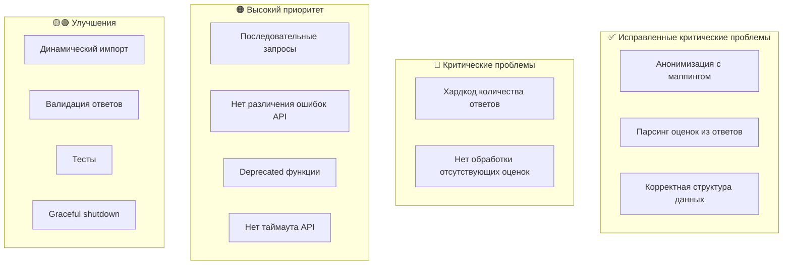

# Актуальный анализ проблем проекта

## Обзор

Проект представляет собой инструмент для сравнения качества ответов LLM моделей разного уровня через OpenRouter API. После анализа кода выявлено, что **критические проблемы #1, #2, #3 из предыдущего анализа уже исправлены**.

---

## ✅ ИСПРАВЛЕННЫЕ ПРОБЛЕМЫ

### ~~#1. Нарушена логика анонимизации и оценки ответов~~ ✅ ИСПРАВЛЕНО

**Файл:** [`src/compare.ts:60-95`](src/compare.ts:60)

Функция `anonymizeResponses` теперь возвращает `AnonymizationResult` с маппингом:
```typescript
return {
  responses: anonymizedResponses,
  mapping  // Сохраняется маппинг между номерами и моделями!
};
```

### ~~#2. Оценки не парсятся из ответов моделей~~ ✅ ИСПРАВЛЕНО

**Файл:** [`src/compare.ts:124-136`](src/compare.ts:124)

Теперь используется `parseAllRatings`:
```typescript
const parsedRatings = parseAllRatings(content);
const ratings: ResponseRating[] = [];
for (let i = 1; i <= 3; i++) {
  const parsed = parsedRatings.get(i);
  ratings.push({
    responseNumber: i,
    score: parsed?.score ?? 0,
    analysis: parsed?.analysis ?? ''
  });
}
```

### ~~#3. Нарушена логика сравнения~~ ✅ ИСПРАВЛЕНО

**Файл:** [`src/types.ts:71-76`](src/types.ts:71)

Структура `ModelComparison` теперь содержит массив оценок:
```typescript
export interface ModelComparison {
  modelId: string;
  modelName: string;
  modelLevel: ModelLevel;
  ratings: ResponseRating[];  // Оценки для всех трёх ответов
}
```

---

## ✅ ИСПРАВЛЕННЫЕ КРИТИЧЕСКИЕ ПРОБЛЕМЫ

### ~~#4. Хардкод количества ответов~~ ✅ ИСПРАВЛЕНО

**Файл:** [`src/compare.ts:129`](src/compare.ts:129)

**Было:**
```typescript
for (let i = 1; i <= 3; i++) {  // Хардкод!
```

**Стало:**
```typescript
for (let i = 1; i <= anonymizedResponses.length; i++) {
```

---

### ~~#5. Нет обработки отсутствующих оценок~~ ✅ ИСПРАВЛЕНО

**Файл:** [`src/compare.ts:133-134`](src/compare.ts:133)

**Было:**
```typescript
score: parsed?.score ?? 0,  // Молчаливо ставим 0
analysis: parsed?.analysis ?? ''
```

**Стало:**
```typescript
if (!parsed) {
  console.warn(`⚠️  Не удалось распарсить оценку для Ответа ${i} от модели ${modelConfig.name}`);
}
ratings.push({
  responseNumber: i,
  score: parsed?.score ?? 0,
  analysis: parsed?.analysis ?? ''
});
```

---

## 🟠 ВЫСОКИЙ ПРИОРИТЕТ

### #6. Последовательное выполнение запросов вместо параллельного

**Файл:** [`src/index.ts:98-106`](src/index.ts:98)

**Проблема:** Запросы к моделям выполняются последовательно:
```typescript
for (const model of models) {
  const response = await processModel(...);  // Последовательно!
  responses.push(response);
}
```

**Последствия:**
- Общее время выполнения = сумма времён всех моделей
- При параллельном выполнении время = max(время одной модели)

**Решение:** Использовать `Promise.all` для параллельного выполнения.

---

### #7. Отсутствие различения типов ошибок API

**Файл:** [`src/api.ts:54-64`](src/api.ts:54)

**Проблема:** Все ошибки обрабатываются одинаково - retry для любых ошибок:
```typescript
} catch (err) {
  lastError = err instanceof Error ? err : new Error(String(err));
  // Нет проверки типа ошибки!
  if (attempt === this.maxRetries) break;
  await this.delay(this.retryDelayMs * attempt);
}
```

**Последствия:**
- Retry выполняется даже для ошибок аутентификации (401)
- Нет смысла повторять запрос с неверным API ключом

**Решение:** Добавить проверку кодов ошибок (4xx не повторять, 5xx повторять).

---

### #8. Deprecated функции в api.ts

**Файл:** [`src/api.ts:118-179`](src/api.ts:118)

**Проблема:** Функции помечены как `@deprecated`, но экспортируются:
```typescript
/**
 * @deprecated Используйте ApiClient.fromConfig()
 */
export function initApiClient(config: Config): void { ... }
```

**Последствия:**
- Загромождают API модуля
- Могут использоваться по ошибке

**Решение:** Удалить deprecated функции, так как они не используются в проекте.

---

### #9. Нет таймаута для API запросов

**Файл:** [`src/api.ts:39-68`](src/api.ts:39)

**Проблема:** Запросы к API не имеют таймаута.

**Последствия:**
- При "зависании" API программа будет ждать бесконечно
- Нет контроля над максимальным временем выполнения

**Решение:** Добавить `timeout` в конфигурацию OpenAI клиента.

---

## 🟡 СРЕДНИЙ ПРИОРИТЕТ

### #10. Динамический импорт типов

**Файл:** [`src/report.ts:216`](src/report.ts:216)

**Проблема:**
```typescript
finalConclusion: import('./types').FinalConclusion
```

**Решение:** Использовать обычный импорт наверху файла.

---

### #11. Отсутствие валидации ответа API

**Файл:** [`src/api.ts:93-98`](src/api.ts:93)

**Проблема:** Проверяется только наличие `choices`, но не валидность `content`:
```typescript
return response.choices[0].message.content ?? '';  // content может быть null
```

**Решение:** Добавить проверку на пустую строку и выбросить ошибку.

---

### #12. Нет проверки на пустой ответ модели

**Проблема:** Если модель вернёт пустой ответ, программа продолжит работу с пустой строкой.

**Решение:** Добавить валидацию в `getModelResponse`.

---

### #13. Дублирование кода вывода

**Файлы:** [`src/output.ts`](src/output.ts) и [`src/report.ts:184-207`](src/report.ts:184)

**Проблема:** Функции `printModelResponse` и секция в `printReport` выполняют похожую работу.

**Решение:** Унифицировать функции вывода.

---

## 🟢 НИЗКИЙ ПРИОРИТЕТ

### #14. Отсутствие тестов

**Проблема:** Проект не содержит модульных тестов.

**Решение:** Добавить Jest или Vitest с тестами для критических функций.

---

### #15. Нет graceful shutdown

**Проблема:** При прерывании процесса (Ctrl+C) нет корректного завершения.

**Решение:** Добавить обработку SIGINT/SIGTERM.

---

### #16. Нет логирования в файл

**Проблема:** Весь вывод идёт только в консоль.

**Решение:** Добавить опциональное логирование в файл для отладки.

---

## Визуализация текущего состояния



---

## Приоритет исправлений

| Приоритет | Проблема | Влияние |
|-----------|----------|---------|
| 🔴 P0 | #4, #5 | Потенциальные баги при изменении конфигурации |
| 🟠 P1 | #6, #7, #8, #9 | Производительность и надёжность |
| 🟡 P2 | #10, #11, #12, #13 | Качество кода |
| 🟢 P3 | #14, #15, #16 | Улучшения |

---

## Рекомендуемый план исправлений

### Этап 1: Критические исправления
1. Убрать хардкод количества ответов в [`compare.ts`](src/compare.ts:129)
2. Добавить предупреждения при неудачном парсинге оценок

### Этап 2: Производительность и надёжность
3. Параллельные запросы к моделям в [`index.ts`](src/index.ts:98)
4. Различение типов ошибок API в [`api.ts`](src/api.ts:54)
5. Удалить deprecated функции
6. Добавить таймаут для API запросов

### Этап 3: Качество кода
7. Исправить динамический импорт
8. Добавить валидацию ответов API
9. Унифицировать функции вывода

### Этап 4: Улучшения
10. Добавить тесты
11. Добавить graceful shutdown
12. Добавить логирование в файл
