# Анализ проблем проекта

## Обзор

Проект представляет собой инструмент для сравнения качества ответов LLM моделей разного уровня через OpenRouter API. После тщательного анализа кода выявлены следующие проблемы.

---

## 🔴 КРИТИЧЕСКИЕ ПРОБЛЕМЫ

### 1. Нарушена логика анонимизации и оценки ответов

**Файл:** [`src/compare.ts`](src/compare.ts:57-65)

**Проблема:** Функция `anonymizeResponses` перемешивает ответы случайным образом, но **не сохраняет маппинг** между номерами анонимных ответов и реальными моделями.

```typescript
// Текущая реализация - маппинг теряется!
export function anonymizeResponses(responses: ModelResponse[]): AnonymizedResponse[] {
  const shuffled = [...responses].sort(() => Math.random() - 0.5);
  return shuffled.map((response, index) => ({
    number: index + 1,
    content: response.content
  }));
}
```

**Последствия:**
- Невозможно определить, какую оценку получила каждая модель
- В итоговом отчёте оценки не соответствуют реальным моделям
- Весь смысл анонимного сравнения теряется

**Решение:** Добавить возврат маппинга для восстановления соответствия.

---

### 2. Оценки не парсятся из ответов моделей

**Файл:** [`src/compare.ts`](src/compare.ts:70-103)

**Проблема:** В функции `getModelComparison` оценка всегда равна `0`, а `responseNumber` всегда `0`.

```typescript
// Оценка всегда 0!
return {
  modelId: modelConfig.id,
  modelName: modelConfig.name,
  modelLevel,
  responseNumber: 0,  // Захардкожено!
  rating: {
    score: 0,         // Захардкожено!
    analysis: content
  }
};
```

**При этом:** Функция [`parseAllRatings`](src/prompts.ts:115-137) существует, но **не используется**!

**Последствия:**
- Все оценки в отчёте показывают `0/10`
- Невозможно сравнить качество ответов количественно

**Решение:** Использовать `parseAllRatings` для извлечения оценок из ответа модели.

---

### 3. Нарушена логика сравнения - каждая модель оценивает все ответы

**Файл:** [`src/compare.ts`](src/compare.ts:70-103)

**Проблема:** Функция `getModelComparison` возвращает **один объект** `ModelComparison`, но модель оценивает **три ответа**.

```typescript
// Модель оценивает 3 ответа, но возвращается только 1 объект?
return {
  ...
  responseNumber: 0,  // Какой из трёх ответов?
  rating: {
    score: 0,
    analysis: content  // Содержит оценки всех трёх ответов
  }
};
```

**Последствия:**
- Структура данных не соответствует логике работы
- Оценки всех трёх ответов "запакованы" в одну строку `analysis`

**Решение:** Изменить структуру - каждая модель должна возвращать 3 оценки (по одной на каждый ответ).

---

## 🟠 ВЫСОКИЙ ПРИОРИТЕТ

### 4. Последовательное выполнение запросов вместо параллельного

**Файл:** [`src/index.ts`](src/index.ts:98-106)

**Проблема:** Запросы к моделям выполняются последовательно:

```typescript
for (const model of models) {
  const response = await processModel(...);  // Последовательно!
  responses.push(response);
}
```

**Последствия:**
- Общее время выполнения = сумма времён всех моделей
- При параллельном выполнении время = max(время одной модели)

**Решение:** Использовать `Promise.all` для параллельного выполнения.

---

### 5. Отсутствие различения типов ошибок API

**Файл:** [`src/api.ts`](src/api.ts:54-67)

**Проблема:** Все ошибки обрабатываются одинаково - retry для любых ошибок.

```typescript
} catch (err) {
  lastError = err instanceof Error ? err : new Error(String(err));
  // Нет проверки типа ошибки!
  if (attempt === this.maxRetries) break;
  await this.delay(this.retryDelayMs * attempt);
}
```

**Последствия:**
- Retry выполняется даже для ошибок аутентификации (401)
- Нет смысла повторять запрос с неверным API ключом

**Решение:** Добавить проверку кодов ошибок (4xx не повторять, 5xx повторять).

---

### 6. Deprecated функции в api.ts

**Файл:** [`src/api.ts`](src/api.ts:118-179)

**Проблема:** Функции помечены как `@deprecated`, но экспортируются и могут использоваться.

```typescript
/**
 * @deprecated Используйте ApiClient.fromConfig()
 */
export function initApiClient(config: Config): void { ... }
```

**Решение:** Удалить deprecated функции или заменить на предупреждения в runtime.

---

## 🟡 СРЕДНИЙ ПРИОРИТЕТ

### 7. Дублирование кода вывода

**Файлы:** [`src/output.ts`](src/output.ts:54-77) и [`src/report.ts`](src/report.ts:136-159)

**Проблема:** Функции `printSummary` и `printReport` выполняют почти одинаковую работу.

**Решение:** Унифицировать функции вывода.

---

### 8. Отсутствие валидации ответа API

**Файл:** [`src/api.ts`](src/api.ts:93-98)

**Проблема:** Проверяется только наличие `choices`, но не валидность `content`.

```typescript
export function extractContent(response: ...): string {
  if (!response.choices || response.choices.length === 0) {
    throw new Error('Пустой ответ от API');
  }
  return response.choices[0].message.content ?? '';  // content может быть null
}
```

**Решение:** Добавить проверку на `null` и пустую строку.

---

### 9. Нет проверки на пустой ответ модели

**Проблема:** Если модель вернёт пустой ответ, программа продолжит работу с пустой строкой.

**Решение:** Добавить валидацию в `getModelResponse`.

---

## 🟢 НИЗКИЙ ПРИОРИТЕТ

### 10. Динамический импорт типов

**Файл:** [`src/report.ts`](src/report.ts:168)

```typescript
finalConclusion: import('./types').FinalConclusion
```

**Решение:** Использовать обычный импорт.

---

### 11. Отсутствие тестов

**Проблема:** Проект не содержит модульных тестов.

**Решение:** Добавить Jest или Vitest с тестами для критических функций.

---

### 12. Нет graceful shutdown

**Проблема:** При прерывании процесса (Ctrl+C) нет корректного завершения.

**Решение:** Добавить обработку SIGINT/SIGTERM.

---

## Визуализация архитектуры проблемы

```mermaid
flowchart TD
    subgraph Проблема[Текущее состояние]
        A1[Модели отвечают] --> B1[Анонимизация<br/>без маппинга]
        B1 --> C1[Модели оценивают]
        C1 --> D1[Оценки не парсятся<br/>score = 0]
        D1 --> E1[Отчёт с неверными данными]
    end
    
    subgraph Решение[Должно быть]
        A2[Модели отвечают] --> B2[Анонимизация<br/>с маппингом]
        B2 --> C2[Модели оценивают]
        C2 --> D2[Парсинг оценок<br/>score = 1-10]
        D2 --> E2[Восстановление маппинга]
        E2 --> F2[Корректный отчёт]
    end
```



---

## Приоритет исправлений

| Приоритет | Проблема | Влияние |
|-----------|----------|---------|
| 🔴 P0 | #1, #2, #3 | Программа выдаёт некорректные результаты |
| 🟠 P1 | #4, #5 | Производительность и надёжность |
| 🟡 P2 | #6, #7, #8, #9 | Качество кода |
| 🟢 P3 | #10, #11, #12 | Улучшения |

---

## Рекомендуемый план исправлений

1. **Этап 1 (Критический):** Исправить логику анонимизации и парсинг оценок
2. **Этап 2 (Важный):** Параллельные запросы и обработка ошибок
3. **Этап 3 (Улучшения):** Рефакторинг и тесты
