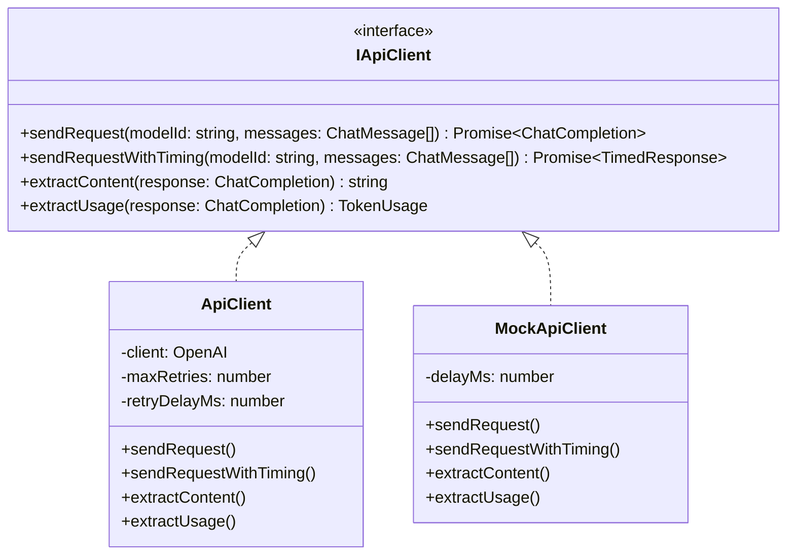

# План: Добавление моков для API

## Обзор

Добавление возможности запуска программы с мокированным API для тестирования без реальных запросов к OpenRouter.

## Архитектура



## Изменения в файлах

### 1. src/types.ts - Добавить интерфейс IApiClient

```typescript
export interface IApiClient {
  sendRequest(modelId: string, messages: ChatMessage[]): Promise<OpenAI.Chat.Completions.ChatCompletion>;
  sendRequestWithTiming(modelId: string, messages: ChatMessage[]): Promise<{ 
    response: OpenAI.Chat.Completions.ChatCompletion; 
    responseTimeMs: number 
  }>;
  extractContent(response: OpenAI.Chat.Completions.ChatCompletion): string;
  extractUsage(response: OpenAI.Chat.Completions.ChatCompletion): TokenUsage;
}
```

### 2. src/api.ts - Реализовать интерфейс

- ApiClient реализует IApiClient
- Добавить класс MockApiClient с простыми заглушками
- Добавить фабричную функцию createApiClient

### 3. src/api-mock.ts - Новый файл с MockApiClient

```typescript
export class MockApiClient implements IApiClient {
  // Возвращает минимальные тестовые данные
  // Имитирует задержку ответа
}
```

### 4. src/index.ts - Использовать фабрику

```typescript
// Было:
const apiClient = ApiClient.fromConfig(config);

// Станет:
const apiClient = createApiClient(config);
```

### 5. package.json - Добавить новый скрипт

```json
{
  "scripts": {
    "start:mock": "USE_MOCK_API=true ts-node src/index.ts"
  }
}
```

## Структура мок-ответов

MockApiClient будет возвращать:

1. **Для ответов моделей** - простой текст с указанием уровня модели
2. **Для сравнений** - оценки по шкале 1-10 с базовым анализом
3. **Для итогового вывода** - краткое резюме

Пример мок-ответа:
```
[MOCK] Ответ от модели strong. 
Это тестовый ответ для проверки работы программы без реальных API запросов.
```

## Переключение режимов

| Режим | Команда | Переменная окружения |
|-------|---------|---------------------|
| Реальный API | `npm start` | USE_MOCK_API не задан или false |
| Мок API | `npm run start:mock` | USE_MOCK_API=true |

## Преимущества подхода

1. **Минимальные изменения** - только добавление интерфейса и фабрики
2. **Обратная совместимость** - существующий код продолжает работать
3. **Простота тестирования** - можно запускать без API ключа
4. **Чистая архитектура** - разделение через интерфейс
